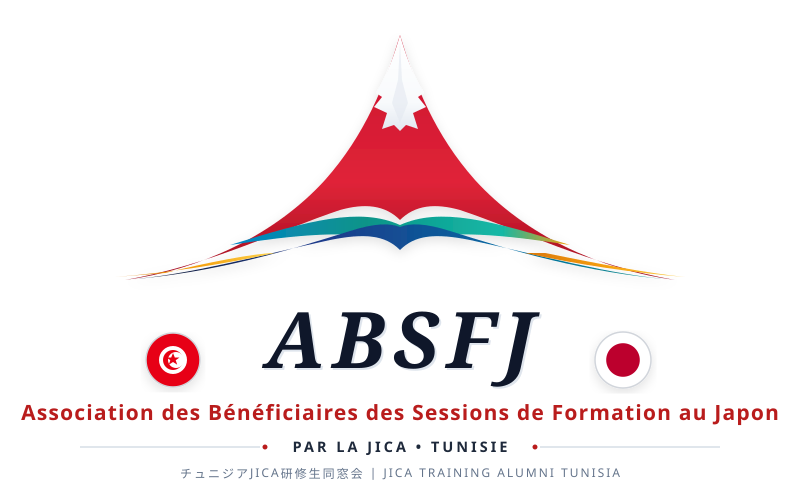

# 🇹🇳 ABSFJ - Association des Bénéficiaires des Sessions de Formation de la JICA au Japon 🇯🇵

  
   
  <b>チュニジアJICA研修生同窓会 • JICA Training Alumni Tunisia</b>
   
  <i>Unir les Compétences, Bâtir l'Avenir entre la Tunisie et le Japon</i>

  
  
  

---

## 🌟 Présentation

L'**ABSFJ** (*Association des Bénéficiaires des Sessions de Formation de la JICA au Japon*) réunit la communauté d'élite de plus de **1 800 cadres, ingénieurs, médecins, hauts fonctionnaires et experts tunisiens** ayant bénéficié de programmes de formation et de transfert de savoir-faire au Japon sous l'égide de la **JICA** (*Japan International Cooperation Agency*) depuis 1975.

Présidée par **S.E. M. Jamel Boujdaria**, diplomate de carrière décoré par Sa Majesté l'Empereur du Japon de l'**Ordre du Soleil Levant, Rayons d'Or avec Rosette**, l'association œuvre au renforcement des liens d'amitié bilatéraux et à la diffusion de l'excellence méthodologique japonaise.

---

## 🏛️ Piliers Stratégiques & Missions

1. **Réseau & Synergie (KIZUNA 絆) :** Fédérer le réseau des boursiers et experts alumni tunisiens, encourager le mentorat et coopérer avec les réseaux alumni JICA en Afrique.
2. **Philosophie KAIZEN (改善) :** Promouvoir l'amélioration continue, l'approche 5S et l'optimisation des processus dans l'industrie, les services publics et le secteur de la santé.
3. **Transition Écologique (環境) :** Piloter et vulgariser des technologies vertes durables, notamment la méthode semi-aérobie de Fukuoka pour la gestion des déchets (projet pilote de Béja avec l'ANGED et EX Research) et la décarbonation industrielle.
4. **Amitié & Coopération (友好) :** Faciliter les échanges économiques, académiques et culturels, incluant des initiatives d'accueil et de guides touristiques pour les délégations japonaises.

---

## 📸 Contenu & Médias Intégrés

- **Logo Officiel Vectoriel HD :** `assets/images/logo-absfj.svg`
- **Sceau Circulaire Officiel :** `assets/images/logo-absfj-badge.svg`
- **Couverture Officielle Facebook :** `assets/images/hero-fb-banner.jpg`
- **Portrait Officiel du Président :** `assets/images/president-jamel-boujdaria.jpg`
- **Visuels d'Événements :** Lancement à la Cité des Sciences, Séminaire Décarbonation, Méthode Fukuoka à Béja, Kaizen Hospitalier.
- **Galerie Photographique & Patrimoine :** Mont Fuji, Sidi Bou Saïd, Fleurs de Cerisiers (Sakura).

---

## 💻 Fonctionnalités du Site

- **Design biculturel sur-mesure** : Harmonie des couleurs tunisiennes (rouge carmin, bleu Sidi Bou Saïd) et japonaises (indigo, or, sakura).
- **Thème Sombre / Thème Clair** avec bascule instantanée et persistance locale.
- **Animation poétique de pétales de cerisiers (Sakura)** en arrière-plan.
- **Filtres interactifs** pour explorer les événements par catégorie (Assemblées, Kaizen, Environnement, Réseau).
- **Générateur interactif de carte de membre numérique en temps réel** avec puce dorée et badge personnalisé.
- **Téléchargement direct du logo** en format vectoriel SVG haute résolution.

---

## 🚀 Accès & Déploiement

- **Site Web en Ligne (GitHub Pages) :** [https://akiroussama.github.io/ABSFJ/](https://akiroussama.github.io/ABSFJ/)
- **Visualisation Locale :** Ouvrez simplement le fichier `index.html` dans un navigateur web moderne.
